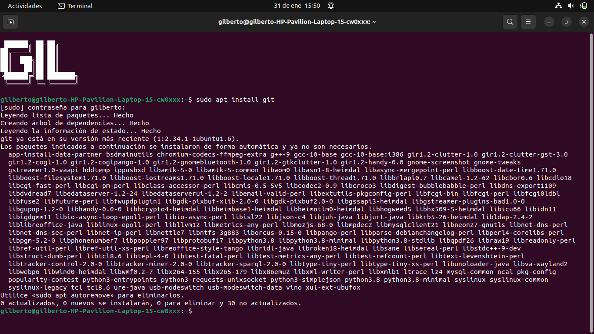
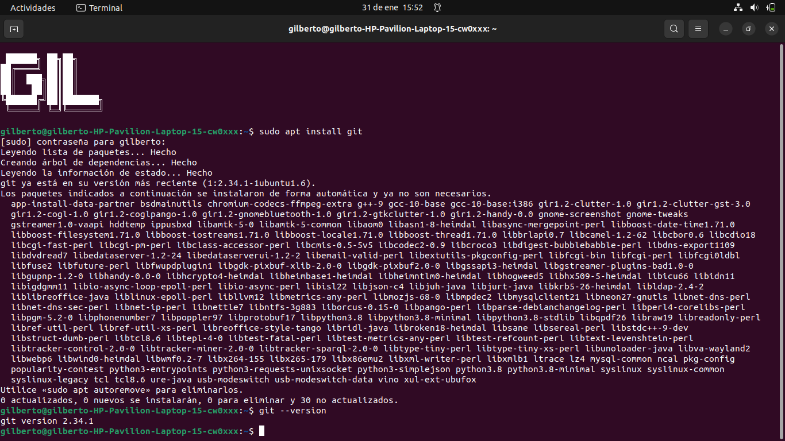
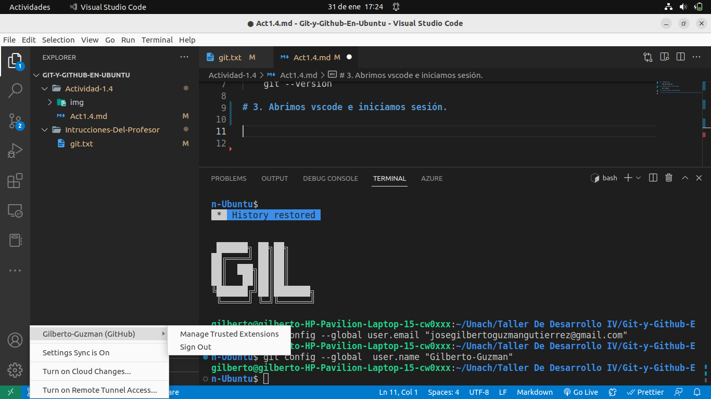
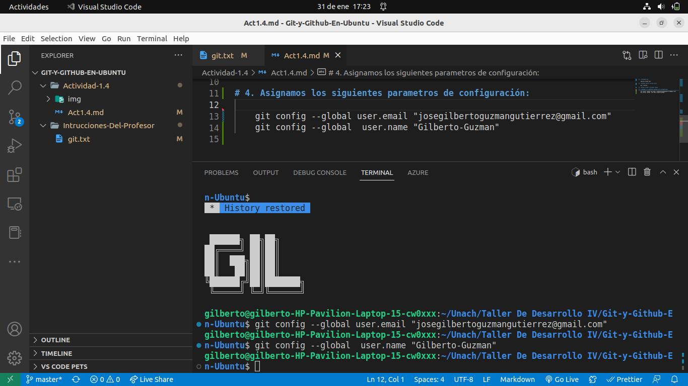
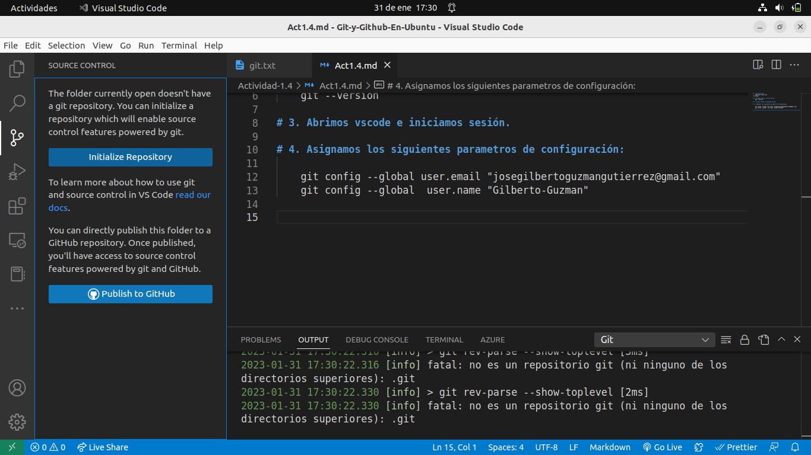
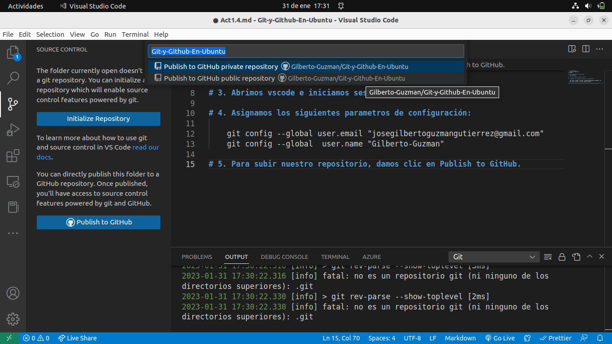
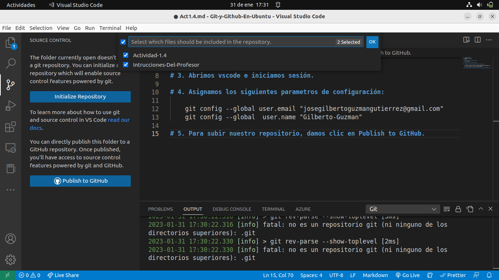
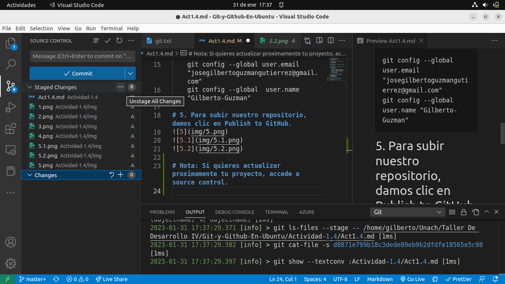
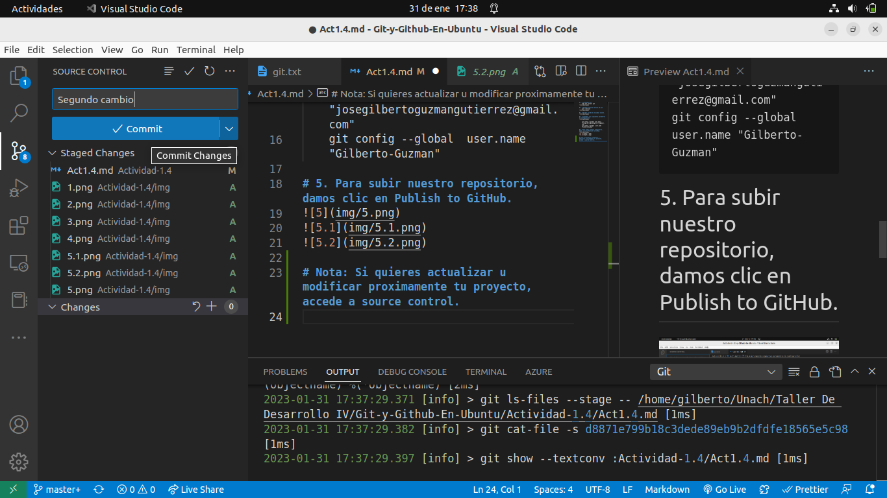
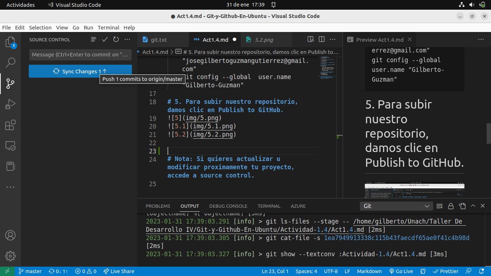

# 1. Instalamos git.
    sudo apt install git

# 2. Checamos nuestra version de git.
    git --version

# 3. Abrimos vscode e iniciamos sesión.
### Nota: Es necesario tener una cuenta de github ya creada.

# 4. Asignamos los siguientes parametros de configuración:

    git config --global user.email "josegilbertoguzmangutierrez@gmail.com"
    git config --global  user.name "Gilberto-Guzman"

# 5. Para subir nuestro repositorio, damos clic en Publish to GitHub.

# 6. Para actualizar el repositorio, nos dirigiremos a source control.

# 7. Ya ahi, daremos clic en el signo + para subir nuestros cambios, y luego confirmaremos los cambios mediante el boton commit.

# 8. Por ultimo daremos clic en: sincronizar cambios.

# Y listo, ya podremos vizualizar nuestro repositorio en github: https://github.com/Gilberto-Guzman/Git-y-Github-En-Ubuntu
